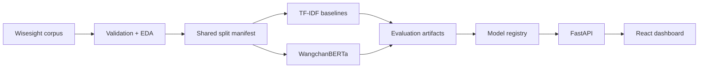

# Thai Review Sentiment Intelligence

[](https://github.com/Praciller/thai-review-sentiment-intelligence/actions/workflows/ci.yml)


[](LICENSE)
[](https://thai-review-sentiment-intelligence.onrender.com)

End-to-end Thai NLP portfolio project for loading and validating customer-review
data, training comparable sentiment models, serving inference through FastAPI, and
turning predictions into operational insights in React.

<p align="center">
  
</p>

## 30-Second Portfolio Review

1. Scan the [model results](#model-results) and why macro F1 selected the model.
2. Review the [architecture](docs/architecture.md) and generated
   [error analysis](reports/error_analysis.md).
3. Try the [live demo](https://thai-review-sentiment-intelligence.onrender.com)
   or run locally, then upload
   [`data/sample/sample_reviews.csv`](data/sample/sample_reviews.csv).
4. Check the verified quality gates and explicit limitations below.

The public demo and local workflow use the trained Logistic Regression artifact.
The free Render instance may need about 50 seconds to wake after inactivity.

## Verified Quality

Latest verification refresh: August 30, 2026:

- 57 backend tests passed on clean `origin/main`, covering data, inference,
  governance, routing, explanations, monitoring, active learning, API
  contracts, and guardrails.
- 5 frontend tests, ESLint, TypeScript, and the Vite production build passed.
- Ruff checks, Python byte-compilation, repository guardrails, and whitespace
  validation passed for this documentation refresh.
- The latest merged-main GitHub Actions run passed the backend, frontend, and
  deployment-image jobs. This documentation-only refresh did not retrain or
  tune a model.
- Docker/Compose and public Render smoke evidence is kept as historical
  evidence unless a current verification explicitly reruns those checks.

## Project Overview

Businesses receive Thai customer feedback faster than teams can read it. This
project classifies reviews as positive, negative, neutral, or question; exposes
confidence and probabilities; supports CSV batches; and summarizes issues such as
waiting time, service, delivery, price, and product quality.

## Problem Statement

Manual review does not scale and simple positive/negative counts hide uncertainty.
The system keeps model evidence visible, routes question-like feedback separately,
and highlights low-confidence or negative reviews for human follow-up.

## Key Features

- Reproducible Wisesight corpus loader with source metadata.
- Markdown validation report and scriptable EDA with saved figures.
- Thai normalization/tokenization for TF-IDF while preserving raw Transformer text.
- Logistic Regression and calibrated Linear SVM baselines.
- PyTorch WangchanBERTa Trainer with CPU-friendly debug mode.
- Shared split manifest and common evaluation/error-analysis outputs.
- FastAPI single and batch inference with strict input limits and configured CORS.
- Macro-F1 governance, confidence routing, approximate evidence, and typed operational metadata.
- CI-safe monitoring/drift and synthetic active-learning queue reports.
- Responsive React dashboard, CSV preview, filters, loading, and error states.
- Optional local MLflow and Docker Compose.

## Dataset

Wisesight Sentiment Corpus from
[PyThaiNLP](https://github.com/PyThaiNLP/wisesight-sentiment).

Observed raw distribution:

| Label | Reviews |
|---|---:|
| Neutral | 14,572 |
| Negative | 6,824 |
| Positive | 4,778 |
| Question | 575 |
| **Total** | **26,749** |

Three duplicates were removed. See [data source](docs/data_source.md) and
[validation report](reports/data_validation_report.md).

## Tech Stack

Python 3.12, pandas, scikit-learn, PyThaiNLP, PyTorch, Transformers, FastAPI,
React 19, Vite 8, Tailwind CSS 4, Recharts, pytest, Vitest, Docker, optional MLflow.

## Architecture



Details: [architecture](docs/architecture.md).

## Project Structure

```text
src/
  data/          corpus loading, validation, EDA
  features/      Thai preprocessing and topic rules
  models/        splitting, training, registry, prediction
  evaluation/    metrics, comparison, error analysis
  api/           FastAPI application
frontend/src/
  components/    reusable workflow and analytics UI
  pages/         prediction, batch, dashboard
  services/      HTTP client
  types/         API contracts
  utils/         CSV parsing and aggregation
```

## Setup Instructions

### Zero-Cost Offline Review

The default review path uses ten manually authored synthetic Thai fixtures and
the deterministic `demo-rule-based` predictor. It needs no API key, hosted
database, private review data, external AI service, or network call after Python
dependencies are installed.

```powershell
python -m venv .venv
.\.venv\Scripts\Activate.ps1
python -m pip install -r requirements-ci.txt
$env:DATA_MODE = "synthetic"
$env:MODEL_MODE = "local"
$env:ENABLE_EXTERNAL_AI = "false"
$env:MODEL_BACKEND = "demo"
python -m pytest
python scripts/generate_local_sentiment_report.py
python scripts/check_repo_guardrails.py
```

Inspect the ignored `reports/local_sentiment_report.md`. It shows normalized
text, PyThaiNLP tokens, deterministic sentiment scores, aspect terms, and known
failures. These synthetic fixture checks are not a general accuracy estimate and
must not be used for automated business decisions without human review.

Full commands and expected output: [local review guide](docs/local_review.md).

### Windows PowerShell

```powershell
python -m venv .venv
.\.venv\Scripts\Activate.ps1
pip install -r requirements.txt
Copy-Item .env.example .env
```

### macOS/Linux

```bash
python -m venv .venv
source .venv/bin/activate
pip install -r requirements.txt
cp .env.example .env
```

Python 3.10+ is supported. Python 3.12 was used for verification.

## How to Run Data Pipeline

```powershell
python -m src.data.load_wisesight
python -m src.data.validate_data
python -m src.data.eda
```

Generated data CSV files are ignored by Git and reproducible from the source.

## How to Train Models

```powershell
python -m src.models.train_baseline --seed 42
python -m src.models.train_transformer --debug --seed 42 --cpu
python -m src.models.train_transformer --seed 42 --epochs 3 --batch-size 8
python -m src.evaluation.evaluate_model
python -m src.evaluation.error_analysis
```

WangchanBERTa full training is faster with a CUDA GPU, but no paid GPU is
required. Debug mode was verified on CPU.

## Optional Local MLflow

Baseline training logs parameters and metrics when MLflow is enabled:

```powershell
$env:MLFLOW_ENABLED = "true"
$env:MLFLOW_TRACKING_URI = "sqlite:///mlflow.db"
python -m src.models.train_baseline --seed 42
mlflow ui --backend-store-uri sqlite:///mlflow.db --port 5000
```

Open <http://127.0.0.1:5000>. Tracking remains local; `mlflow.db` and
`mlartifacts/` are ignored by Git.

## Model Results

Shared test set, seed 42:

| Model | Accuracy | Macro F1 | Weighted F1 | Notes |
|---|---:|---:|---:|---|
| TF-IDF + Logistic Regression | 0.6545 | **0.5731** | 0.6608 | Selected by macro F1 |
| TF-IDF + Linear SVM | **0.7116** | 0.5305 | **0.6909** | Calibrated probabilities |
| WangchanBERTa Fine-tuned | Not run | Not run | Not run | Debug pipeline verified; full benchmark pending |

Accuracy alone favors the majority-heavy SVM. Macro F1 selects Logistic
Regression because it balances performance across all four labels.
The table records the Windows verification run. The Linux production image
reproduced the same model selection with 0.5720 macro F1; small last-digit
variation is expected across numerical backends.

## Robustness challenge evaluation

The **Wisesight held-out evaluation** above is the model-selection and final-test evidence. The separate [Thai sentiment robustness challenge report](reports/robustness_challenge.md) uses 27 manually authored, synthetic examples across 9 slices covering negation, code switching, slang, emphasis, questions, mixed sentiment, length, spelling variation, and defensible sarcasm-like cases.

This challenge set is frozen diagnostic evidence only: it is not training,
hyperparameter-tuning, or model-selection data, and contains no scraped
customer reviews or private data. Re-run it against the existing baseline
artifact with `python -m src.evaluation.robustness_challenge`; use `--demo-only`
only when intentionally producing the separate deterministic demo result
without a baseline artifact. The current report keeps the weakest baseline
slices visible: defensible sarcasm-like examples score 0.0000 accuracy, while
negation and question-like examples score 0.3333 each. No model tuning was
performed on challenge data.

## How to Run API

```powershell
uvicorn src.api.main:app --reload --port 8000
```

- Health: <http://localhost:8000/health>
- Swagger: <http://localhost:8000/docs>

Without a trained artifact, development uses an explicit `demo-rule-based`
predictor. Production refuses to start without a real model.

## API Examples

```powershell
Invoke-RestMethod `
  -Method Post `
  -Uri http://localhost:8000/predict `
  -ContentType application/json `
  -Body '{"text":"อาหารอร่อยมาก บริการดี"}'
```

See [API documentation](docs/api.md).

## Governance and Monitoring

- [Model governance](docs/model_governance.md): macro-F1 selection and per-class evaluation.
- [Confidence routing](docs/confidence_routing.md): auto-label, review, support, and escalation rules.
- [Explainability](docs/explainability.md): TF-IDF evidence with deterministic fallback.
- [Monitoring](docs/monitoring.md): local distributions, drift proxy, and warning flags.
- [Active-learning queue](docs/active_learning.md): synthetic review prioritization.
- [Security/privacy](docs/security_privacy.md): offline-data and tracked-content guardrails.

## How to Run React Frontend

```powershell
Set-Location frontend
npm install
npm run dev
```

Open <http://localhost:5173>. The default API URL is
`http://localhost:8000`; override it with `VITE_API_URL`.

## Docker

### Local development

```powershell
docker compose up --build
```

- Frontend: <http://localhost:5173>
- API: <http://localhost:8000>
- API docs: <http://localhost:8000/docs>

The API image is baseline-focused to keep it smaller. Mount a local
`models/baseline_model.joblib` through Compose, or use development demo mode.

### Production container

```powershell
docker build -t thai-review-sentiment-intelligence .
docker run --rm -p 7860:7860 thai-review-sentiment-intelligence
```

Open <http://localhost:7860>. The multi-stage image builds React, trains the
selected baseline from a pinned Wisesight corpus revision, and serves the UI and
API from one FastAPI process. No model binary is committed to Git.

[Live demo](https://thai-review-sentiment-intelligence.onrender.com) ·
[Health endpoint](https://thai-review-sentiment-intelligence.onrender.com/health)

[](https://render.com/deploy?repo=https://github.com/Praciller/thai-review-sentiment-intelligence)

## Screenshots

### Single prediction and analytics


### Batch CSV analysis


### Mobile layout


## Error Analysis

The selected baseline made 1,386 errors across 4,012 test reviews (34.5%).
Generated analysis covers confused label pairs, error rate by length, and hard
examples. See [error-analysis documentation](docs/error_analysis.md) and
[generated report](reports/error_analysis.md).

## Business Impact

- Detect negative-review volume without manually reading every message.
- Surface recurring operational issues such as waiting time, delivery, or service.
- Route question-type reviews to customer support.
- Send low-confidence predictions to a human review queue.
- Compare model changes on a stable test set before deployment.

## Limitations

- Wisesight labels do not represent every real business taxonomy.
- Sarcasm, slang, code-switching, and mixed sentiment remain difficult.
- One review receives one sentiment label even when it contains conflicting views.
- Topic classification is rule-based, not a trained topic model.
- Debug Transformer metrics are not meaningful model benchmarks.
- Monitoring is a local synthetic demo, not live production monitoring.
- Authentication and persistence are not included.

## Future Improvements

- Complete full WangchanBERTa training and tune class imbalance.
- Add an authenticated annotation workflow if real review correction is required.
- Train topic classification from labeled business data.
- Connect monitoring to privacy-reviewed production telemetry if deployment scope requires it.
- Add authentication and persistent review history.
- Integrate with restaurant POS/review workflows.

## Documentation

- [Local review](docs/local_review.md)
- [Model methodology](docs/model_methodology.md)
- [Data card](docs/data_card.md)
- [Portfolio review](docs/portfolio_review.md)
- [Architecture](docs/architecture.md)
- [Data source](docs/data_source.md)
- [Modeling](docs/modeling_approach.md)
- [API](docs/api.md)
- [Frontend](docs/frontend.md)
- [Error analysis](docs/error_analysis.md)
