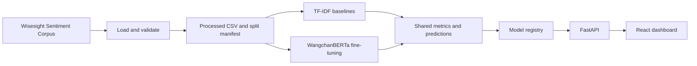

# Architecture

## System View

## Boundaries

- `src/data`: corpus access, validation, and reproducible EDA artifacts.
- `src/features`: Thai text cleaning, tokenization, labels, and rule-based topics.
- `src/models`: deterministic splitting, training, model loading, and inference.
- `src/evaluation`: common metrics, model comparison, confusion matrix, errors.
- `src/api`: HTTP validation and inference orchestration only.
- `frontend/src/services`: the only frontend layer that knows API URLs.
- `frontend/src/pages`: workflow composition, not data parsing or HTTP details.

## Runtime Modes

`MODEL_BACKEND=auto` selects a local Transformer checkpoint, then a baseline
joblib bundle. Development falls back to a clearly named `demo-rule-based`
predictor when no trained artifact exists. Production fails startup if no model is
available.

The model is loaded once in FastAPI lifespan. Request handlers only validate input
and call the already-loaded predictor.

## Data Consistency

`data/processed/split_manifest.csv` is the comparison contract. Both model
families reuse the same row IDs for train, validation, and test. Model selection
uses macro F1 because the question class is much smaller than neutral.
